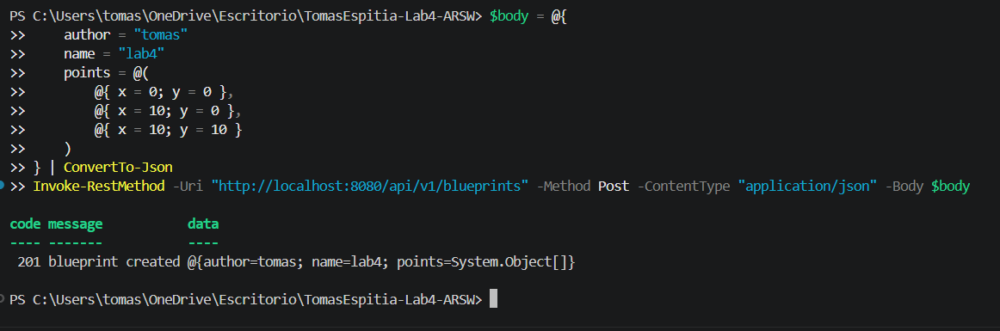
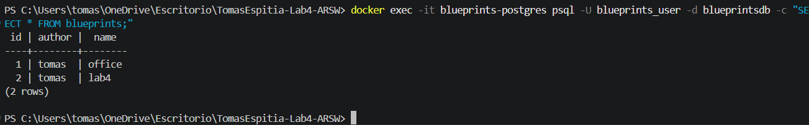
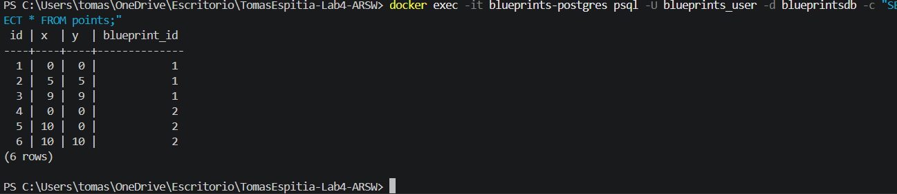
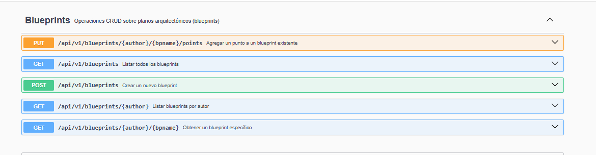
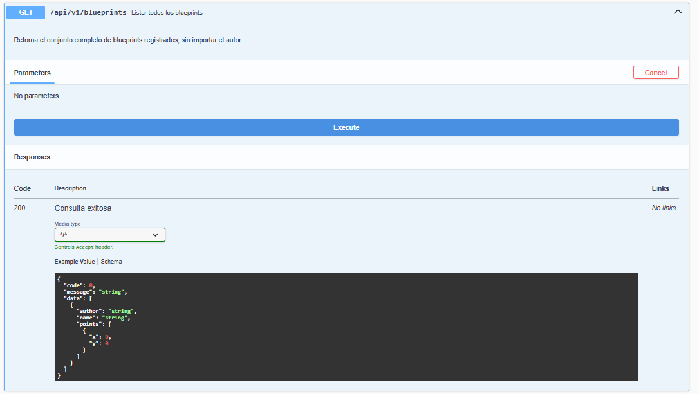
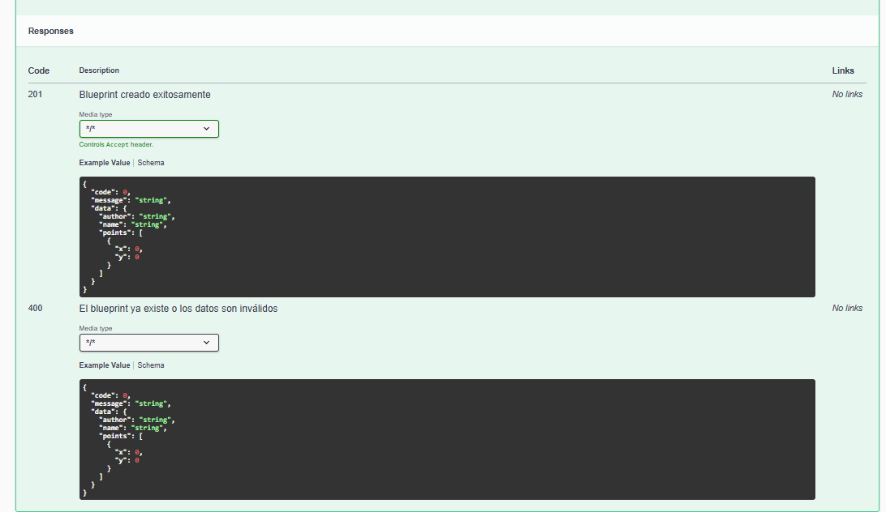
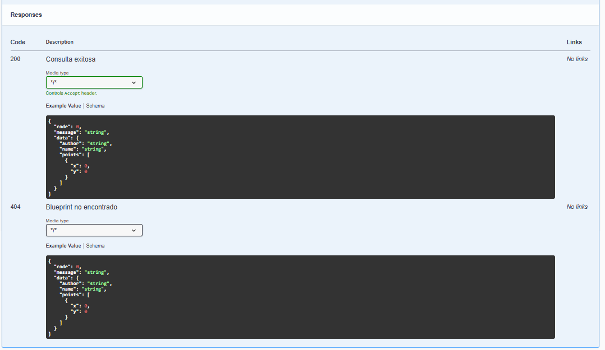
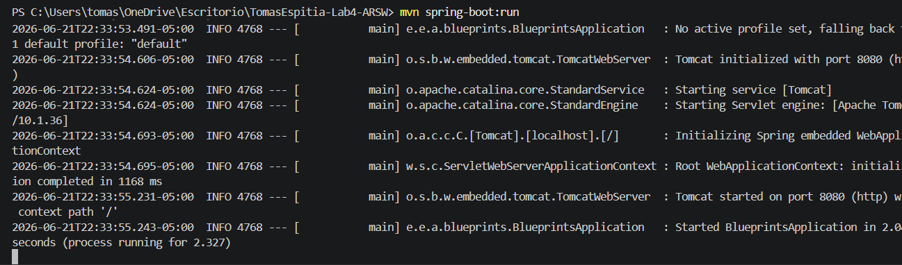

# Lab 4 — Blueprints REST API

**Estudiante:** Tomás Espitia  
**Curso:** Arquitecturas de Software (ARSW) — 2026-1  
**Universidad:** Escuela Colombiana de Ingeniería Julio Garavito  

---

## ¿De qué trata este laboratorio?

El objetivo de este laboratorio fue construir una API REST para gestionar planos arquitectónicos llamados *blueprints*. Cada blueprint tiene un autor, un nombre y una lista de puntos `(x, y)` que representan coordenadas en el plano.

El reto no era solo hacer que los endpoints funcionaran, sino hacerlo bien: con una arquitectura en capas limpia, buenas prácticas REST, persistencia real en PostgreSQL, documentación automática con Swagger y filtros de post-procesamiento activables por perfiles de Spring.

---

## Stack utilizado

- **Java 21** con **Spring Boot 3.3.9**
- **Spring Data JPA + Hibernate** para la capa de persistencia
- **PostgreSQL 16** como base de datos, corriendo en un contenedor Docker
- **SpringDoc OpenAPI** para la documentación automática (Swagger UI)
- **Docker + Docker Compose** para levantar la base de datos
- **Maven** como herramienta de build

---

## Estructura del proyecto

```
src/
├── main/java/edu/eci/arsw/blueprints/
│   ├── controllers/       # Controlador REST con los 5 endpoints
│   ├── dto/               # ApiResponse<T> — envoltorio genérico de respuestas
│   ├── filters/           # Tres filtros: Identity, Redundancy, Undersampling
│   ├── model/             # Clases de dominio: Blueprint y Point
│   ├── persistence/       # Interfaz BlueprintPersistence + dos implementaciones
│   │   └── jpa/           # Entidades JPA y repositorio de Spring Data
│   └── services/          # BlueprintsServices — orquesta persistencia y filtros
└── resources/
    ├── application.properties               # Configuración base (modo memoria)
    └── application-postgres.properties      # Configuración para el perfil postgres
```

---

## Punto 1 — Restructuración de la API REST

Lo primero fue reorganizar el controlador para que siguiera buenas prácticas REST. Cambié el path base de `/blueprints` a `/api/v1/blueprints` para versionarlo correctamente.

También creé un record genérico `ApiResponse<T>` en el paquete `dto` que envuelve todas las respuestas de la API con tres campos: `code`, `message` y `data`. La idea es que el cliente siempre reciba una respuesta con la misma estructura, sin importar si fue exitosa o si ocurrió un error.

Ajusté los códigos HTTP de cada endpoint según su semántica real:

| Método | Ruta | Código éxito | Código error |
|--------|------|-------------|--------------|
| GET | `/api/v1/blueprints` | 200 | — |
| GET | `/api/v1/blueprints/{author}` | 200 | 404 |
| GET | `/api/v1/blueprints/{author}/{bpname}` | 200 | 404 |
| POST | `/api/v1/blueprints` | 201 | 400 |
| PUT | `/api/v1/blueprints/{author}/{bpname}/points` | 202 | 404 |

---

## Punto 2 — Persistencia en PostgreSQL

El proyecto venía con una implementación en memoria (`InMemoryBlueprintPersistence`) que usaba un `HashMap`. El objetivo fue agregar una segunda implementación que guardara los datos en una base de datos real.

La solución fue crear `PostgresBlueprintPersistence`, que implementa la misma interfaz `BlueprintPersistence`. Esto es importante: el servicio y el controlador no saben nada de JPA ni de Postgres — simplemente usan la interfaz, y Spring inyecta la implementación correcta según el perfil activo. Es el principio de inversión de dependencias aplicado en la práctica.

Para la capa JPA creé dos entidades separadas del modelo de dominio: `BlueprintEntity` y `PointEntity`, con una relación uno-a-muchos entre ellas. El mapeo entre estas entidades y las clases de dominio (`Blueprint`, `Point`) lo hace `PostgresBlueprintPersistence` internamente.

Levanté PostgreSQL con Docker Compose usando una imagen oficial de Postgres 16. Las credenciales y la URL de conexión van en `application-postgres.properties`, que solo se carga cuando el perfil `postgres` está activo.

Para que JPA no interfiriera con el modo memoria (que no necesita base de datos), excluí las autoconfiguaciones de JPA/DataSource en `application.properties` y las reactivé en `application-postgres.properties`.

### Evidencia — creación de un blueprint via API contra Postgres

En la siguiente imagen se ve la respuesta del endpoint `POST /api/v1/blueprints` corriendo con el perfil `postgres` activo. El código `201` confirma que el blueprint fue creado exitosamente y persistido en la base de datos real, no en memoria.



### Evidencia — datos reales en la tabla `blueprints`

Aquí se puede ver el resultado de hacer un `SELECT` directamente sobre la tabla `blueprints` dentro del contenedor de PostgreSQL. Se ven los dos blueprints creados durante las pruebas, con sus respectivos autores y nombres guardados correctamente.



### Evidencia — datos reales en la tabla `points`

Esta imagen muestra la tabla `points`. Cada fila tiene su coordenada `(x, y)` y la clave foránea `blueprint_id` que la relaciona con su blueprint correspondiente. Se puede ver que la relación uno-a-muchos entre blueprints y puntos quedó correctamente reflejada en la base de datos.



---

## Punto 3 — Documentación con Swagger / OpenAPI

El proyecto ya tenía la dependencia de SpringDoc OpenAPI en el `pom.xml` y un `OpenApiConfig` básico. Lo que faltaba era anotar los endpoints del controlador con `@Operation`, `@ApiResponses` y `@Parameter` para que la documentación generada automáticamente fuera útil y descriptiva.

Agregué en cada endpoint un `summary` (descripción corta), una descripción larga, los posibles códigos de respuesta con su significado, y ejemplos en los parámetros de path.

Un detalle a resolver fue que SpringDoc tiene una clase `@ApiResponse` con el mismo nombre que mi record `ApiResponse<T>`. Lo resolví usando el nombre completo del paquete de SpringDoc en las anotaciones para evitar el conflicto de imports.

### Evidencia — vista general de Swagger UI con los 5 endpoints

En esta imagen se ve la interfaz de Swagger con los 5 endpoints agrupados bajo el tag "Blueprints" y sus descripciones cortas visibles directamente en la lista.



### Evidencia — GET /api/v1/blueprints con schema de ApiResponse

Al expandir el endpoint se puede ver la descripción completa y el schema de ejemplo de la respuesta, que refleja exactamente la estructura `ApiResponse<T>` con `code`, `message` y `data`.



### Evidencia — GET /{author}/{bpname} con códigos 200 y 404 documentados

Esta imagen muestra los dos posibles códigos de respuesta del endpoint de consulta específica, con sus descripciones en español tal como se anotaron en el controlador.



### Evidencia — POST con códigos 201 y 400 documentados

Aquí se ven los códigos de respuesta del endpoint de creación: `201` cuando el blueprint se crea exitosamente y `400` cuando ya existe o los datos son inválidos.



---

## Punto 4 — Filtros por perfil de Spring

El proyecto traía tres filtros implementados: `IdentityFilter`, `RedundancyFilter` y `UndersamplingFilter`. El filtro se aplica únicamente en el endpoint `GET /api/v1/blueprints/{author}/{bpname}`, dentro del método `getBlueprint` del servicio.

El problema que encontré al activar los perfiles `redundancy` o `undersampling` fue que Spring veía dos beans implementando `BlueprintsFilter` al mismo tiempo: el `IdentityFilter` (que no tenía `@Profile`) y el del perfil activo. Eso causaba un error de ambigüedad al arrancar.

La solución fue agregar `@Profile("!redundancy & !undersampling")` al `IdentityFilter`, indicándole a Spring que solo lo registre como bean cuando ninguno de los otros perfiles de filtro esté activo. El mismo patrón que ya se usó con `InMemoryBlueprintPersistence` y `@Profile("!postgres")`.

| Perfil | Filtro activo | Comportamiento |
|--------|--------------|----------------|
| `default` | `IdentityFilter` | Devuelve los puntos sin modificar |
| `redundancy` | `RedundancyFilter` | Elimina puntos consecutivos duplicados |
| `undersampling` | `UndersamplingFilter` | Conserva 1 de cada 2 puntos (índices pares) |

### Evidencia — RedundancyFilter

Se creó un blueprint con 5 puntos donde había pares consecutivos duplicados: `(1,1),(1,1),(2,2),(2,2),(3,3)`. Al consultarlo con el perfil `redundancy` activo, el filtro eliminó los duplicados y la respuesta devolvió únicamente los 3 puntos distintos. El filtro funciona comparando cada punto con el anterior y descartando el actual si son iguales.

### Evidencia — UndersamplingFilter

Se creó un blueprint con 6 puntos: `(1,1),(2,2),(3,3),(4,4),(5,5),(6,6)`. Al consultarlo con el perfil `undersampling` activo, el filtro conservó solo los puntos en posiciones de índice par (0, 2, 4) y la respuesta devolvió `(1,1),(3,3),(5,5)`. Esto reduce la densidad de puntos a la mitad.

---

## Cómo ejecutar

### Prerrequisitos
- Java 21
- Maven 3.9+
- Docker Desktop instalado y corriendo

### Modo memoria (sin base de datos)
```bash
mvn spring-boot:run
```

### Modo PostgreSQL
```bash
# Primero levantar el contenedor
docker compose up -d

# Luego correr la app con el perfil postgres
mvn spring-boot:run "-Dspring-boot.run.profiles=postgres"
```

### Con filtro de redundancia
```bash
mvn spring-boot:run "-Dspring-boot.run.profiles=redundancy"
```

### Con filtro de undersampling
```bash
mvn spring-boot:run "-Dspring-boot.run.profiles=undersampling"
```

### Swagger UI
Con la app corriendo, accede a:
```
http://localhost:8080/swagger-ui.html
```

---

## Arranque de la aplicación

Esta imagen muestra el log de arranque de Spring Boot en modo `default` (sin perfiles activos), confirmando que la app levanta en el puerto 8080 en aproximadamente 2 segundos.

